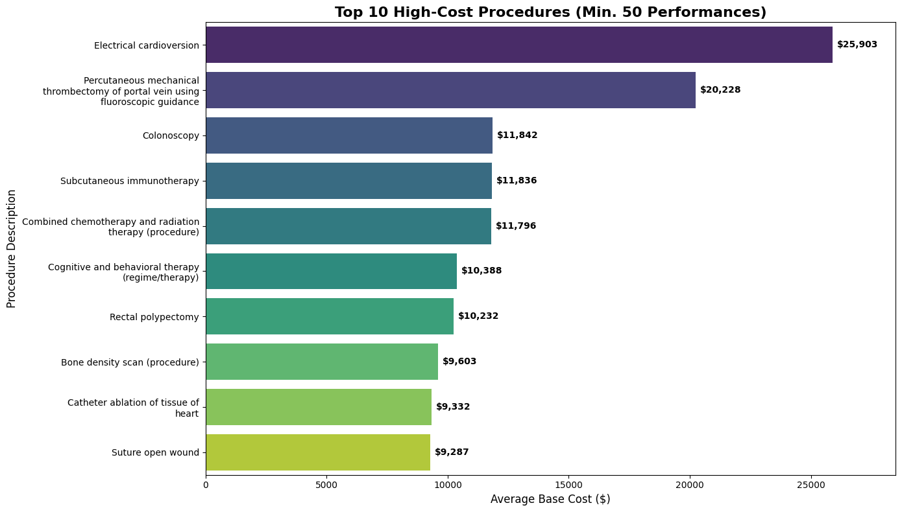
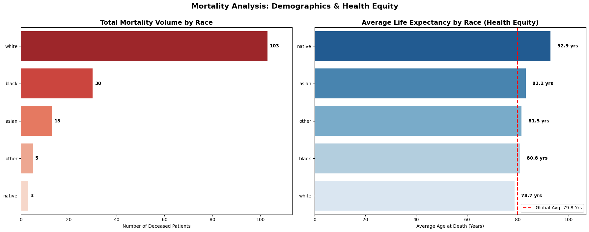

# Hospital Financial & Operational Health Analysis in Python


## 1. Executive Summary

This project presents a data-driven audit of hospital operations, financial performance, and patient health equity. By analyzing patient, procedural, and financial datasets with Python, this report identifies critical areas of revenue leakage, operational inefficiency, and demographic health disparities. The findings provide a clear, evidence-based foundation for strategic decision-making aimed at improving both the hospital's financial stability and its quality of patient care.

*   **The Problem:** The hospital is facing significant financial pressure from underpaying insurance payers, high-cost procedures, and inefficient patient flow. Simultaneously, the board requires insights into health equity across the patient population. A comprehensive analysis is needed to pinpoint the root causes and guide corrective action.

*   **Key Findings:**
    *   **Critical Insurance Underpayment:** Key insurance partners systematically underpay for services. **UnitedHealthcare** exhibits the most severe "coverage gap," paying on average only **0.15%** of the total billed amount, creating substantial patient bad debt.
    *   **High-Cost, High-Volume Procedures:** "Electrical cardioversion" is the most significant high-cost driver, with an average base cost of **$25,903** and performed over 1,300 times.
    *   **Significant Health Disparities:** A notable gap in life expectancy exists among patient demographics. The **white** patient population has the lowest average age at death (**78.7 years**), which is below the hospital's overall average of 79.8 years and significantly lower than the **native** population's average of 92.9 years.
    *   **Operational Inefficiency in Emergency Care:** Emergency room visits are **60% more expensive** on average than ambulatory (outpatient) visits (**$4,630 vs. $2,894**), despite generating less than a third of the total revenue.

*   **Business Impact:** These insights empower leadership to take immediate, targeted action. This includes renegotiating contracts with underperforming payers, optimizing pricing for high-cost procedures, launching health equity initiatives to address demographic disparities, and implementing strategies to divert non-critical cases from the costly Emergency Room to more efficient ambulatory clinics.

---

## 2. Key Business Questions & Analysis

### I. Insurance Coverage Gap Analysis

*   **Business Question:** "We are seeing an increase in patient bad debt. Which insurance payers have the lowest coverage ratios, and what is our total financial exposure to them?"

*   **Key Insight:** Several major payers have critically low coverage ratios. **UnitedHealthcare (0.15%)**, **Aetna (0.07%)**, and **Humana (0.06%)** pay less than a fifth of a percent of the billed amount on average. While UnitedHealthcare has the worst ratio, **Humana** represents the largest single source of financial exposure among the bottom performers, with **$3.5 million** in total claims billed.

*   **Supporting Visual:**

    
    
    *Caption: This dual chart powerfully illustrates the problem. The red chart on the left identifies the payers with the worst coverage ratios (the "problem"), while the blue chart on the right quantifies the total billed revenue associated with them (the "financial risk").*

*   **Actionable Recommendation:**
    *   Immediately initiate a contract and claims review with **UnitedHealthcare**, **Aetna**, and **Anthem** to address the systematic underpayments.
    *   Prioritize an audit of the **$3.5 million** in claims submitted to **Humana** to identify specific procedures or codes that are being denied or underpaid.

---

### II. High-Cost Procedure Identification

*   **Business Question:** "For our next fiscal review, we need to identify the procedures that are the primary drivers of our costs. Which high-volume procedures have the highest average cost?"

*   **Key Insight:** After filtering for procedures performed at least 50 times, **"Electrical cardioversion"** is identified as the most significant high-cost procedure, averaging **$25,903** per performance. The top 10 list also includes complex interventions like **"Percutaneous mechanical thrombectomy"** at **$20,228**, indicating that specialized cardiovascular and oncological services are major cost centers.

*   **Supporting Visual:**

    
    
    *Caption: This bar chart ranks the top 10 most expensive procedures that are frequently performed (min. 50 times). It provides a clear guide to the services that have the largest impact on the hospital's cost structure.*

*   **Actionable Recommendation:**
    *   Conduct a profitability analysis on the top 3 procedures (Cardioversion, Thrombectomy, Colonoscopy) to ensure that reimbursement rates are aligned with their high base costs.
    *   Review resource utilization (staffing, equipment, room time) for these procedures to identify opportunities for cost savings without compromising care quality.

---

### III. Mortality & Health Equity Analysis

*   **Business Question:** "The Board requires an analysis of patient longevity and health equity. What are the mortality trends across different patient demographics?"

*   **Key Insight:** There is a significant disparity in life expectancy across racial demographics. The **native** patient population has the highest average life expectancy at **92.9 years**. Conversely, the **white** patient population has the lowest at **78.7 years**, which is more than a year below the hospital-wide average of 79.8 years. The white demographic also represents the highest volume of total deaths (103).

*   **Supporting Visual:**

    
    
    *Caption: This dual chart separates mortality volume from life expectancy. The chart on the left shows the total number of deaths by race, while the chart on the right visualizes the average age at death, highlighting disparities in longevity and health equity.*

*   **Actionable Recommendation:**
    *   Initiate a clinical research study to investigate the underlying factors contributing to the lower life expectancy observed in the white patient population within our care system.
    *   Develop targeted wellness and preventative care programs for the demographic groups with the lowest life expectancies to address potential chronic conditions earlier.

---

### IV. Strategic Cost Analysis: Ambulatory vs. Emergency Care

*   **Business Question:** "To reduce costs, we want to shift non-critical patients from the Emergency Room to Ambulatory clinics. What is the financial justification for this strategy?"

*   **Key Insight:** The data provides a clear financial mandate for this strategy. An average **Emergency visit costs $4,630**, which is **60% more expensive** than an **Ambulatory visit at $2,894**. Despite this high unit cost, the Emergency department generates significantly less total revenue (**$10.8M**) compared to the Ambulatory department (**$36.3M**), making it a high-cost, lower-volume service line.

*   **Supporting Visual:**

    
    
    *Caption: This side-by-side comparison clearly shows that while Ambulatory care is the hospital's revenue engine (left), Emergency care is a major cost driver on a per-visit basis (right), justifying the strategic shift.*

*   **Actionable Recommendation:**
    *   Launch a patient education campaign to promote the use of ambulatory and urgent care clinics for non-life-threatening conditions.
    *   Invest a portion of the potential cost savings into expanding ambulatory service hours and capabilities to better absorb patient volume diverted from the Emergency Room.

---

## 3. Data & Methodology

*   **Data Source:** The analysis was performed on a set of six CSV files representing a hospital's electronic health record system, including data on patients, encounters, procedures, and payers.
*   **Methodology:** The analysis was conducted in Python using the Pandas library for data manipulation, aggregation, and merging. All visualizations were created using Matplotlib and Seaborn to provide clear, business-focused data stories. Key steps included calculating financial ratios, filtering data based on business rules (e.g., minimum encounter counts), and aggregating data to compare performance across different categories.

---

## 4. Limitations & Future Work

*   **Limitations:**
    *   **Static Dataset:** The analysis is based on a historical, static dataset, which may not reflect current operational realities or recent changes in payer contracts.
    *   **No CPT Codes:** The procedure data uses descriptive names rather than standardized CPT codes, which can make direct comparison to industry financial benchmarks challenging.
    *   **Lack of Clinical Nuance:** The data does not include patient comorbidities or severity scores, which could influence both procedure cost and mortality outcomes.

*   **Future Work:**
    *   **Predictive Financial Modeling:** Develop a model to forecast revenue and bad debt based on payer mix and procedure volume.
    *   **Geospatial Health Analysis:** Use patient address data to map health outcomes and identify "hot spots" of specific diseases or demographic risk factors within the community.
    *   **Time-Series Analysis:** Analyze encounter data over time to identify seasonal trends in specific illnesses (e.g., flu season) to improve staffing and resource planning.

---

## 5. Technical Appendix

*   **Tools & Libraries:**
    *   Python 3.9
    *   Pandas
    *   Matplotlib
    *   Seaborn

*   **Setup & Installation:**
    1.  Clone the repository:
        ```bash
        git clone https://github.com/your-username/hospital-health-analysis.git
        cd hospital-health-analysis
        ```
    2.  Install the required libraries:
        ```bash
        pip install pandas matplotlib seaborn
        ```
    3.  Place the required CSV files (`patients.csv`, `encounters.csv`, etc.) in the `data/` directory.
    4.  Execute the Python script or Jupyter Notebook to replicate the analysis.

---

## 📬 Contact
**Selim Najaf**

*   **LinkedIn:** [linkedin.com/in/selimnajaf-data-analyst](https://www.linkedin.com/in/selimnajaf-data-analyst/)
*   **GitHub:** [github.com/SelimNajaf](https://github.com/SelimNajaf)
